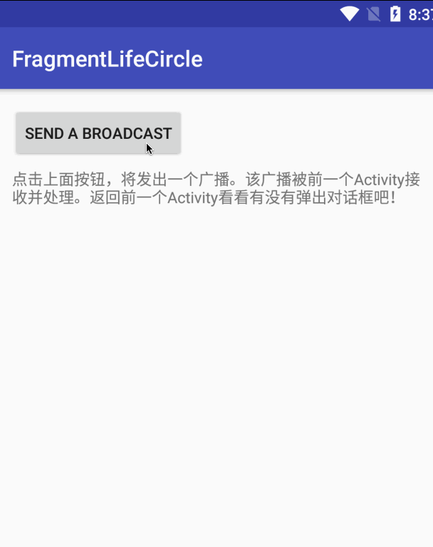

# 内容
java.lang.IllegalStateException: Can not perform this action after onSaveInstanceState

这个Exception是如何发生的？如何避免？

## 原因分析

见[PausedActivity](#)



具体过程如下：

1. PausedActivity启动Paused2Activity，PausedActivity进入paused状态
2. Paused2Activity发出广播
3. PausedActivity收到广播，弹出DialogFragment，发生crash

```
05-04 20:34:52.126 17630-17630/? E/AndroidRuntime: FATAL EXCEPTION: main
       Process: com.example.cm.fragmentlifecircle, PID: 17630
       java.lang.IllegalStateException: Can not perform this action after onSaveInstanceState
           at android.support.v4.app.FragmentManagerImpl.checkStateLoss(FragmentManager.java:2044)
           at android.support.v4.app.FragmentManagerImpl.enqueueAction(FragmentManager.java:2067)
           at android.support.v4.app.BackStackRecord.commitInternal(BackStackRecord.java:680)
           at android.support.v4.app.BackStackRecord.commit(BackStackRecord.java:634)
           at android.support.v4.app.DialogFragment.show(DialogFragment.java:143)
           at com.example.cm.fragmentlifecircle.PausedActivity.showDialogFragment(PausedActivity.kt:54)
           at com.example.cm.fragmentlifecircle.PausedActivity.access$showDialogFragment(PausedActivity.kt:16)
           at com.example.cm.fragmentlifecircle.PausedActivity$mBroadcastReceiver$1.onReceive(PausedActivity.kt:31)
           at android.support.v4.content.LocalBroadcastManager.executePendingBroadcasts(LocalBroadcastManager.java:308)
           at android.support.v4.content.LocalBroadcastManager.sendBroadcastSync(LocalBroadcastManager.java:286)
           at com.example.cm.fragmentlifecircle.Paused2Activity$onCreate$1.onClick(Paused2Activity.kt:27)
           at android.view.View.performClick(View.java:5609)
           at android.view.View$PerformClick.run(View.java:22259)
           at android.os.Handler.handleCallback(Handler.java:751)
           at android.os.Handler.dispatchMessage(Handler.java:95)
           at android.os.Looper.loop(Looper.java:154)
           at android.app.ActivityThread.main(ActivityThread.java:6077)
           at java.lang.reflect.Method.invoke(Native Method)
           at com.android.internal.os.ZygoteInit$MethodAndArgsCaller.run(ZygoteInit.java:865)
           at com.android.internal.os.ZygoteInit.main(ZygoteInit.java:755)
```

Exception发生的原因不难分析。直接看`DialogFragment.show()`方法

```java
    public void show(FragmentManager manager, String tag) {
        mDismissed = false;
        mShownByMe = true;
        FragmentTransaction ft = manager.beginTransaction();
        ft.add(this, tag);
        ft.commit();
    }
```

这里有两点要注意：

+ 该方法没有将FragmentTransaction添加到back stack中，所以dismiss时实际上会新起一个FragmentTransaction
+ 该方法使用`commit()`而不是`commitAllowingStateLoss()`方法提交FragmentTransaction

沿着crash中的信息，可以看到`FragmentTransaction.commit()`最终调用到`FragmentManagerImpl.checkStateLoss()`方法

```java
    // Fra
    private void checkStateLoss() {
        if (mStateSaved) {
            throw new IllegalStateException(
                    "Can not perform this action after onSaveInstanceState");
        }
        if (mNoTransactionsBecause != null) {
            throw new IllegalStateException(
                    "Can not perform this action inside of " + mNoTransactionsBecause);
        }
    }
```

```java
    private void checkStateLoss() {
        if (isStateSaved()) {
            throw new IllegalStateException(
                    "Can not perform this action after onSaveInstanceState");
        }
        if (mNoTransactionsBecause != null) {
            throw new IllegalStateException(
                    "Can not perform this action inside of " + mNoTransactionsBecause);
        }
    }

    @Override
    public boolean isStateSaved() {
        // See saveAllState() for the explanation of this.  We do this for
        // all platform versions, to keep our behavior more consistent between
        // them.
        return mStateSaved || mStopped;
    }
```

上面的代码来自support library 26.1.0和27.1.1的`FragmentManagerImpl`类，代码稍稍不同。

但都是同一个意思：`state saved`状态下不能提交FragmentTransaction。只不过27.1.1中更严格，不仅`state saved`状态下不能提交，`stop`状态也不能提交

[android - getting exception "IllegalStateException: Can not perform this action after onSaveInstanceState"](https://stackoverflow.com/questions/7469082/getting-exception-illegalstateexception-can-not-perform-this-action-after-onsa)给出的回答认为这里之所以发生Exception，是因为Android的bug。

事实上这并不是Android的bug。[Fragment Transactions & Activity State Loss | Android Design Patterns](http://www.androiddesignpatterns.com/2013/08/fragment-transaction-commit-state-loss.html)一文对此作了很好的解释————Android系统设计如此！

另外，[FragmentTransaction.commit()](https://developer.android.com/reference/android/app/FragmentTransaction#commitAllowingStateLoss%28%29)的文档也明确说明了**不能在activity调用onSaveInstanceState()后调用commit()方法**

> A transaction can only be committed with this method prior to its containing activity saving its state. If the commit is attempted after that point, an exception will be thrown. This is because the state after the commit can be lost if the activity needs to be restored from its state. See commitAllowingStateLoss() for situations where it may be okay to lose the commit.


注：Android 3.0之前`onSaveInstanceState(Bundle)`在`onPause()`之前调用，3.0之后在`onStop()`之后调用。

## 解决办法和建议
一种建议是使用`commitAllowingStateLoss()`代替`commit()`，因为前者避免了上述`checkStateLoss()`检查。

```kotlin
    private fun showDialogFragment() {
        Log.d(TAG, "showDialogFragment")
        MyDialogFragment().show(supportFragmentManager, "dialog")
    }

    private fun showDialogFragmentFixed() {
        Log.d(TAG, "showDialogFragmentFixed")
        val f = MyDialogFragment()
        supportFragmentManager.beginTransaction().add(f, "dialog").commitAllowingStateLoss()
    }
```

`showDialogFragmentFixed()`是`showDialogFragment()`的修复版本，修复版本中不再出现crash了。


关于FragmentTransaction的使用建议：

+ 最好只在`onResume()`状态的Activity中使用`commit()`提交FragmentTransaction
+ 不要在回调中使用`commit()`提交FragmentTransaction
+ 不得已时，可以使用`commitAllowingStateLoss()`代替`commit()`

## commitAllowingStateLoss的区别

`commitAllowingStateLoss()`跟`commit()`到底有什么区别？

`commit()`的文档如下

> Schedules a commit of this transaction. The commit does not happen immediately; it will be scheduled as work on the main thread to be done the next time that thread is ready.
> A transaction can only be committed with this method prior to its containing activity saving its state. If the commit is attempted after that point, an exception will be thrown. This is because the state after the commit can be lost if the activity needs to be restored from its state. See commitAllowingStateLoss() for situations where it may be okay to lose the commit.

`commitAllowingStateLoss`的文档如下

> Like commit() but allows the commit to be executed after an activity's state is saved. This is dangerous because the commit can be lost if the activity needs to later be restored from its state, so this should only be used for cases where it is okay for the UI state to change unexpectedly on the user.

好像没有什么区别，唯一不同就是`commitAllowStateLoss()`可以在`state saved`状态下执行。

用例子来验证区别吧。

验证流程一：

打开开发者设置中的"不保留Activity"，Activity中`resume`状态下使用`commit()`添加一个Fragment，Home键退出app然后再回到app(由于打开了"不保留Activity"，所以Activity实际上经历重建过程，新的Activity并不是之前的Activity)，Activity中仍然可以看到Fragment

我们打出`Activity.onCreate()`方法的bundle参数，可以看到Fragment相关信息。是Activity帮我们恢复了Fragment。

05-04 22:04:22.274 19404-19404/com.example.cm.fragmentlifecircle D/CommitTransaction: onCreate Bundle[{android:viewHierarchyState=Bundle[mParcelledData.dataSize=756], android:support:fragments=android.support.v4.app.FragmentManagerState@ccd410e, android:fragments=android.app.FragmentManagerState@c0b272f}]

注：以上过程中使用`commitAllowingLoss()`代替`commit()`，结果仍然一样。

验证流程二：

关闭开发者设置中的"不保留Activity"，Activity中使`state saved`状态下使用`commitAllowingStateLose()`添加一个Fragment，Home键退出app然后再回到app(由于没有打开"不保留Activity"，所以Activity仍然是之前那个Activity)，Activity中仍然可以看到Fragment

验证流程三：

打开开发者设置中的"不保留Activity"，Activity中使`state saved`状态下使用`commitAllowingStateLose()`添加一个Fragment，Home键退出app然后再回到app(由于打开了"不保留Activity"，所以Activity实际上经历重建过程，新的Activity并不是之前的Activity)，Activity中看不到Fragment了。看不到的原因是因为Fragment是在`state saved`之后被添加到Activity，Activity不再负责恢复它了

```kotlin
    private var mOn: Boolean = false

    // `state saved`状态下使用`commitAllowingStateLose()`添加Fragment
    // Home键退出app时会回调onSaveInstanceState()方法
    override fun onSaveInstanceState(outState: Bundle?) {
        super.onSaveInstanceState(outState)
        Log.d(TAG, "onSaveInstanceState")

        if (mOn) {
            supportFragmentManager
                    .beginTransaction().add(R.id.fl_fragment, ChildFragment.newInstance("commit-allowing-state-loss"))
                    .commitAllowingStateLoss()
            mOn = false
        }
    }

    fun onBtnClick(view: View) {
        when (view.id) {
            R.id.btnCommitAllowingStateLoss -> {
                mOn = true
            }
        }
    }
```


# 生命周期方法

fragment的生命周期，尤其是嵌套fragement的生命周期

attach()和add()后Fragment生命周期变化的差异。

对一个Fragment执行add()操作后，其生命周期变化如下：

onAttach() -> onCreate() -> onCreateView() -> onStart() -> onResume()

接下来再做remove()操作，生命周期变化：

onPause() -> onStop() -> onDestroyView() -> onDestroy() -> onDetach()

如果add()后detach()，则生命周期变化与remove()有所不同

onPause() -> onStop() -> onDestroyView()

可以看到，并没有执行onDestroy()和onDetach()。所以，detach()后是可以再次将fragment attach()回来的

onCreateView() -> onStart() -> onResume()

# demo

## TabLayout + ViewPager

https://developer.android.com/reference/android/support/design/widget/TabLayout

TabLayout + ViewPager方式实现的Tab页

注意off screen特性对生命周期的影响

## FragmentTabHost

https://www.jianshu.com/p/e9c00493aa7e

https://www.jianshu.com/p/491386d6435c

FragmentTabHost方式实现的Tab页

没有off screen特性，所以生命周期跟TabLayout + ViewPager方式有所不同

## ViewPager是如何影响Fragment的生命周期的


##


# 参考

[android - getting exception "IllegalStateException: Can not perform this action after onSaveInstanceState"](https://stackoverflow.com/questions/7469082/getting-exception-illegalstateexception-can-not-perform-this-action-after-onsa)

[Fragment Transactions & Activity State Loss | Android Design Patterns](http://www.androiddesignpatterns.com/2013/08/fragment-transaction-commit-state-loss.html)

[Understand the Activity Lifecycle  |  Android Developers](https://developer.android.com/guide/components/activities/activity-lifecycle#kotlin)

[Fragments  |  Android Developers](https://developer.android.com/guide/components/fragments)

https://blog.csdn.net/jemenchen/article/details/52645380