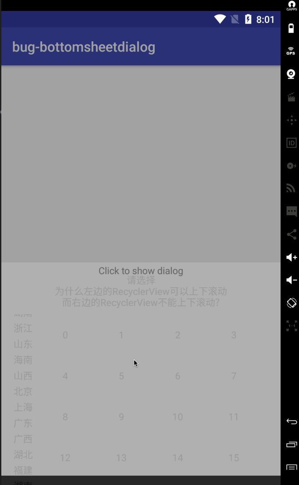

# 问题描述
BottomSheetDialog使用两个RecyclerView，第一个可以上下滚动，而第二个不可以。



Stackoverflow上[这个帖子](https://stackoverflow.com/questions/39326321/scroll-not-working-for-multiple-recyclerview-in-bottomsheet)反馈了同样的问题。

# 原因分析

`BottomSheetBehavior`只支持一个滚动的子节点，它使用`BottomSheetBehavior.findScrollingChild()`` (27.1.0) 找到这个子节点。

```java
    View findScrollingChild(View view) {
        if (ViewCompat.isNestedScrollingEnabled(view)) {
            return view;
        }
        if (view instanceof ViewGroup) {
            ViewGroup group = (ViewGroup) view;
            for (int i = 0, count = group.getChildCount(); i < count; i++) {
                View scrollingChild = findScrollingChild(group.getChildAt(i));
                if (scrollingChild != null) {
                    return scrollingChild;
                }
            }
        }
        return null;
    }
```

所以如果将代码中两个RecyclerView换个位置，你会发现仍然是左边那个可以滚动，而右边那个不行。更准确的说，是XML布局中先出现的那个RecyclerView可以滚动

# 如何解决
[ViewPagerBottomSheet](https://github.com/laenger/ViewPagerBottomSheet)提供了解决办法。

原来的布局文件

```xml
<android.support.constraint.ConstraintLayout xmlns:android="http://schemas.android.com/apk/res/android"
    xmlns:app="http://schemas.android.com/apk/res-auto"
    xmlns:tools="http://schemas.android.com/tools"
    android:layout_width="match_parent"
    android:layout_height="match_parent">

    <TextView
        android:id="@+id/tvTitle"
        android:layout_width="wrap_content"
        android:layout_height="wrap_content"
        android:layout_marginTop="16dp"
        android:gravity="center_horizontal"
        android:text="请选择\n为什么左边的RecyclerView可以上下滚动\n而右边的RecyclerView不能上下滚动?"
        app:layout_constraintLeft_toLeftOf="parent"
        app:layout_constraintRight_toRightOf="parent"
        app:layout_constraintTop_toTopOf="parent" />

    <android.support.v7.widget.RecyclerView
        android:id="@+id/rvProvince"
        android:layout_width="wrap_content"
        android:layout_height="wrap_content"
        android:layout_marginStart="16dp"
        android:layout_marginTop="8dp"
        app:layout_constraintLeft_toLeftOf="parent"
        app:layout_constraintTop_toBottomOf="@+id/tvTitle" />

    <android.support.v7.widget.RecyclerView
        android:layout_marginStart="16dp"
        android:layout_marginEnd="16dp"
        android:layout_marginTop="8dp"
        app:layout_constraintLeft_toRightOf="@id/rvProvince"
        app:layout_constraintTop_toBottomOf="@+id/tvTitle"
        app:layout_constraintRight_toRightOf="parent"
        android:id="@+id/rvCity"
        android:layout_width="0dp"
        android:layout_height="wrap_content"
        tools:layout_editor_absoluteX="64dp"
        tools:layout_editor_absoluteY="43dp" />
</android.support.constraint.ConstraintLayout>
```

新的布局文件: CoordinatorLayout作为两个RecyclerView的父节点，并且其`nestedScrollingEnabled`为true

```xml
<android.support.constraint.ConstraintLayout xmlns:android="http://schemas.android.com/apk/res/android"
    xmlns:app="http://schemas.android.com/apk/res-auto"
    android:layout_width="match_parent"
    android:layout_height="match_parent">

    <TextView
        android:id="@+id/tvTitle"
        android:layout_width="wrap_content"
        android:layout_height="wrap_content"
        android:layout_marginTop="16dp"
        android:gravity="center_horizontal"
        android:text="请选择\n为什么左边的RecyclerView可以上下滚动\n而右边的RecyclerView不能上下滚动?"
        app:layout_constraintLeft_toLeftOf="parent"
        app:layout_constraintRight_toRightOf="parent"
        app:layout_constraintTop_toTopOf="parent" />

    <!--<android.support.v4.widget.NestedScrollView-->
    <android.support.design.widget.CoordinatorLayout
        android:layout_width="0dp"
        android:layout_height="wrap_content"
        android:nestedScrollingEnabled="true"
        app:layout_constraintEnd_toEndOf="parent"
        app:layout_constraintHorizontal_bias="0.5"
        app:layout_constraintStart_toStartOf="parent"
        app:layout_constraintTop_toBottomOf="@+id/tvTitle">

        <RelativeLayout
            android:layout_width="match_parent"
            android:layout_height="match_parent">

            <android.support.v7.widget.RecyclerView
                android:id="@+id/rvProvince"
                android:layout_width="wrap_content"
                android:layout_height="wrap_content"
                android:layout_marginStart="16dp"
                android:layout_marginTop="8dp" />

            <android.support.v7.widget.RecyclerView
                android:layout_toRightOf="@id/rvProvince"
                android:layout_alignParentEnd="true"
                android:id="@+id/rvCity"
                android:layout_width="wrap_content"
                android:layout_height="wrap_content"
                android:layout_gravity="end"
                android:layout_marginEnd="16dp"
                android:layout_marginStart="16dp"
                android:layout_marginTop="8dp" />

        </RelativeLayout>
    <!--</android.support.v4.widget.NestedScrollView>-->

    </android.support.design.widget.CoordinatorLayout>
</android.support.constraint.ConstraintLayout>
```

# 参考资料

<!--more
bug2
bottomsheet中不能有两个recyclcerview
bottomsheet中的recyclverview显示不全
bottomsheet中的recyclver item变形？-->

https://stackoverflow.com/questions/39326321/scroll-not-working-for-multiple-recyclerview-in-bottomsheet
http://blog.flight.dev.qunar.com/2016/11/04/android-nestedScrolling/
https://github.com/laenger/ViewPagerBottomSheet 参考其代码实现